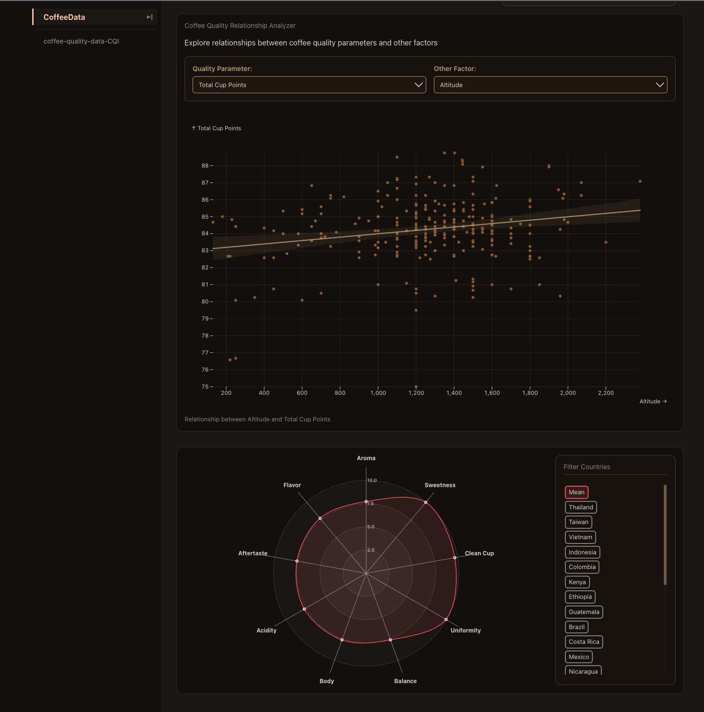

# Koffie Data Visualisatie Project - Procesrapport

## Taakverdeling

| Naam            | Taken                                                           |
|-----------------|---------------------------------------------------------------------------------------|
| Thibaud Collyn  | - Correlatiematrix met aanpasbare parameters - Tekst bij visualisaties - Schetsen van visualisatie ideeën  |
| Ben De Meurichy | - Implementatie van radar chart - Datascrapers en loaders - ParquetKit-ondersteuning - CI/CD Workflow setup |
| Wout Verdyck    | - Implementatie van de hero-sectie - Boxplot voor categorische factoren - Kaartvisualisatie - Kwaliteit vs externe factoren |

## Proceslogboek

### Initiële Setup (17-24 maart 2025)

Het project begon met het opzetten van de basisstructuur van de repository en het plannen van onze aanpak voor de datavisualisatie van koffiegegevens.

**Belangrijke activiteiten:**
- Aanmaken van de repository
- Workflow setup voor publicatie
- Configuratie van de omgeving
- Implementatie van het datascraper-framework

### Gegevensverzameling & eerste visualisatie (25 maart - 5 april 2025)

In deze fase richtten we ons op het bouwen van de datapijplijnen en het voorbereiden van de gegevens voor visualisatie.

**Belangrijke activiteiten:**
- Scrapers testen voor koffiegegevens
- Dataset opgeschoond en duplicaten verwijderd
- Eerste data-exploratie via notebooks
- Kaartvisualisatie toegevoegd met kaart integratie

### Verdere Visualisaties (5-27 april 2025)
We zaten met zen allen samen om een aantal visualisaties op papier uit te denken en vorm te geven zodat we een duidelijk doel hadden en iedereen aan zijn visualisatie kon beginnen. Ook dachten we na over de algemene layout van de webpagina.

Hierna begonnen met het implementeren van de visualisaties en het opsplitsen van de code in verschillende componenten.

**Belangrijke activiteiten:**
- Radar chart geïmplementeerd voor het vergelijken van landen
- index.md opgesplitst in meerdere bestanden voor betere codeorganisatie
- Gegevensproblemen opgelost (bijv. foute waarde in dataset opgelost)
- Onnodige voorbeeldbestanden verwijderd uit Observable
- Vergelijking tussen koffie kwaliteit en externe factoren toegevoegd

### Meeting (17 april 2025)
Tijdens deze meeting hebben we de visualities en ideeën van het project besproken en de volgende stappen gedefinieerd.

### Visualisatieverbetering (28 april - 8 mei 2025)

Deze fase richtte zich op het verfijnen van visualisaties, het toevoegen van de laatste visualisaties, het verbeteren van de styling en het toevoegen van ondersteunende tekstinhoud.

**Belangrijke activiteiten:**
- Verklarende teksten toegevoegd aan visualisaties
- Landen alfabetisch gesorteerd voor betere navigatie
- Stijlen bijgewerkt (typografie, kaartkleuren, uitlijningen)
- Boxplot toegevoegd voor categorische factoren
- Styling verbeterd

### Laatste Verbeteringen (9-11 mei 2025)

De laatste fase bestond uit het toevoegen van de laatste visualisatie en het aanbrengen van stijlverbeteringen.

**Belangrijke activiteiten:**
- Correlatiematrix geïmplementeerd met aanpasbare parameters
- Laatste stijlverbeteringen doorgevoerd in het project (consistente typography, kleuren)
- Hero sectie verbeterd
